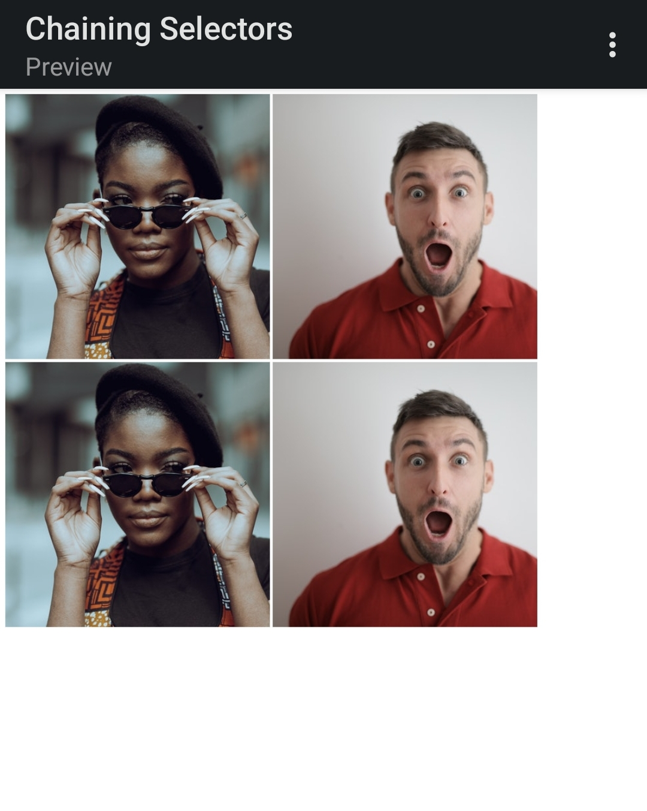

# Chaining Selectors

Credits for the images in this exercise go to [Katho Mutodo](https://www.pexels.com/@photobykatho?utm_content=attributionCopyText&utm_medium=referral&utm_source=pexels) and [Andrea Piacquadio](https://www.pexels.com/@olly?utm_content=attributionCopyText&utm_medium=referral&utm_source=pexels).

For this exercise, it's more important to understand how chaining different selectors works than how to actually add the attributes.

We have two images to style, each with two class names, where one of the class names is shared. The goal here is to chain the selectors for both elements, so that each have a unique style applied, despite using a shared class selector. I included the original images as well, so that we can see how the styles I will be adding look in comparison.

The properties added to each element are:

* Made the element with both the `avatar` and `proportioned` classes 300 pixels wide, then gave it a height so that it retains its original square proportions.
* Made the element with both the `avatar` and `distorted` classes 200 pixels wide, then made its height twice as big as its width.

## Initial

## Desired Outcome

#